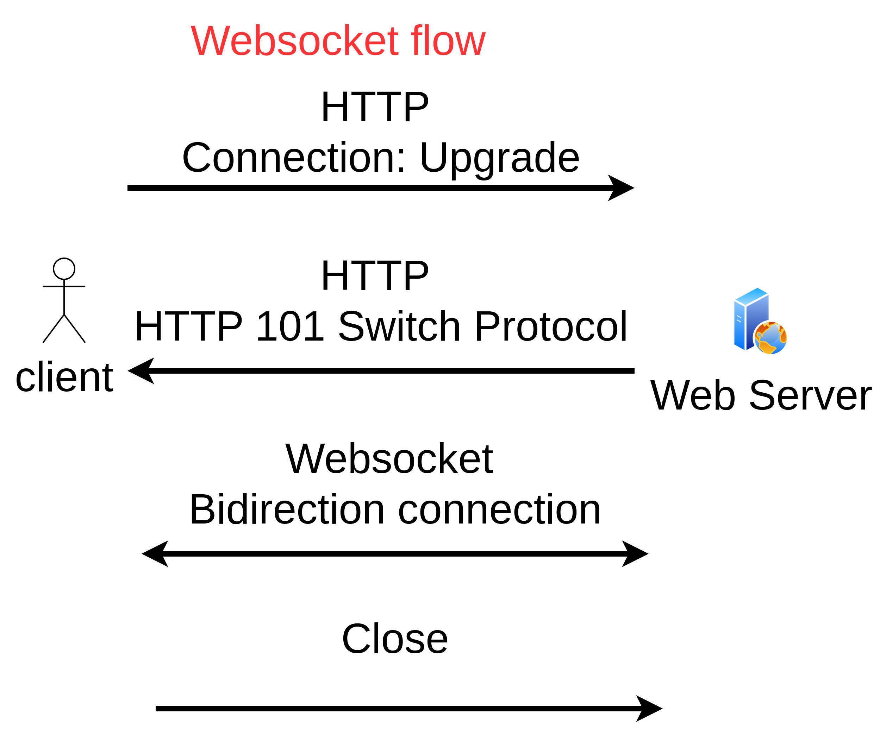

# golang-with-websocket

This repository is demo how to use golang to implementation websocket

## package dependency

1. gorilla/websocket

```shell
go get github.com/gorilla/websocket
```

2. viper

```shell
go get github.com/spf13/viper
```

## setup local certificate and key

```shell
sh gencert.sh
```

## concept



## setup connection 

1. Setup http server
```golang
func main() {
	setupAPI()

	log.Fatal(http.ListenAndServeTLS(":8080", "server.crt", "server.key", nil))
}
func setupAPI() {
	ctx := context.Background()
	manager := NewManager(ctx)
	http.Handle("/", http.FileServer(http.Dir("./frontend")))
	http.HandleFunc("/ws", manager.serveWS)
	http.HandleFunc("/login", manager.loginHandler)
}
```

2. setup protocol upgrader with gorilla/websocket
```golang
func (m *Manager) serveWS(w http.ResponseWriter, r *http.Request) {
	otp := r.URL.Query().Get("otp")
	if otp == "" {
		w.WriteHeader(http.StatusUnauthorized)
		return
	}
	if !m.otps.VerifyOTP(otp) {
		w.WriteHeader(http.StatusUnauthorized)
		return
	}
	log.Println("new connection")
	// upgrade regular http connection into websocket
	conn, err := websocketUpgrader.Upgrade(w, r, nil)
	if err != nil {
		log.Println(err)
		return
	}
	client := NewClient(conn, m)

	m.addClient(client)
	// Start client processes
	go client.readMessages()
	go client.writeMessages()
}
```

3. setup handle connection logic
```golang
// store connection and state
type Manager struct {
	clients ClientList
	sync.RWMutex

	otps     RetentionMap
	handlers map[string]EventHandler
}
// client struct
type ClientList map[*Client]bool

type Client struct {
	connection *websocket.Conn
	manager    *Manager
	// egress is used to avoid concurrent writes on the websocket connection
	egress chan Event
}
```

4. setup client readMessage and writeMessage logic
```golang
func (c *Client) readMessages() {
	defer func() {
		// cleanup connection
		c.manager.removeClient(c)
	}()
	if err := c.connection.SetReadDeadline(time.Now().Add(pongWait)); err != nil {
		log.Println(err)
		return
	}
	c.connection.SetReadLimit(512)
	c.connection.SetPongHandler(c.pongHandler)
	for {
		_, payload, err := c.connection.ReadMessage()
		if err != nil {
			if websocket.IsUnexpectedCloseError(err, websocket.CloseGoingAway, websocket.CloseAbnormalClosure) {
				log.Printf("error reading message: %v", err)
			}
			break
		}
		var request Event
		if err := json.Unmarshal(payload, &request); err != nil {
			log.Printf("error marshalling event: %v", err)
			break
		}
		if err := c.manager.routeEvent(request, c); err != nil {
			log.Printf("error handling message: %v", err)
		}
	}
}

func (c *Client) writeMessages() {
	defer func() {
		c.manager.removeClient(c)
	}()
	ticker := time.NewTicker(pingInterval)
	for {
		select {
		case message, ok := <-c.egress:
			if !ok {
				if err := c.connection.WriteMessage(websocket.CloseMessage, nil); err != nil {
					log.Println("connectin closed:", err)
				}
				return
			}
			data, err := json.Marshal(message)
			if err != nil {
				log.Println(err)
				return
			}
			if err := c.connection.WriteMessage(websocket.TextMessage, data); err != nil {
				log.Printf("failed to send message: %v", err)
			}
			log.Println("message sent")
		case <-ticker.C:
			log.Println("ping")
			// Send a Ping to the Client
			if err := c.connection.WriteMessage(websocket.PingMessage, []byte(``)); err != nil {
				log.Println("writemsg err:", err)
				return
			}
		}
	}
}
```

5. reset timeout on pong handler
```golang
func (c *Client) pongHandler(pongMsg string) error {
	log.Println("pong")
	return c.connection.SetReadDeadline(time.Now().Add(pongWait))
}
```

6. define event handler and setup on manager
```golang

type Event struct {
	Type    string          `json:"type"`
	Payload json.RawMessage `json:"payload"`
}

type EventHandler func(event Event, c *Client) error
func NewManager(ctx context.Context) *Manager {
	m := &Manager{
		clients:  make(ClientList),
		handlers: make(map[string]EventHandler),
		otps:     NewRetentionMap(ctx, 5*time.Second),
	}
	m.setupEventHandlers()
	return m
}

func (m *Manager) setupEventHandlers() {
	m.handlers[EventSendMessage] = SendMessage
}
```

